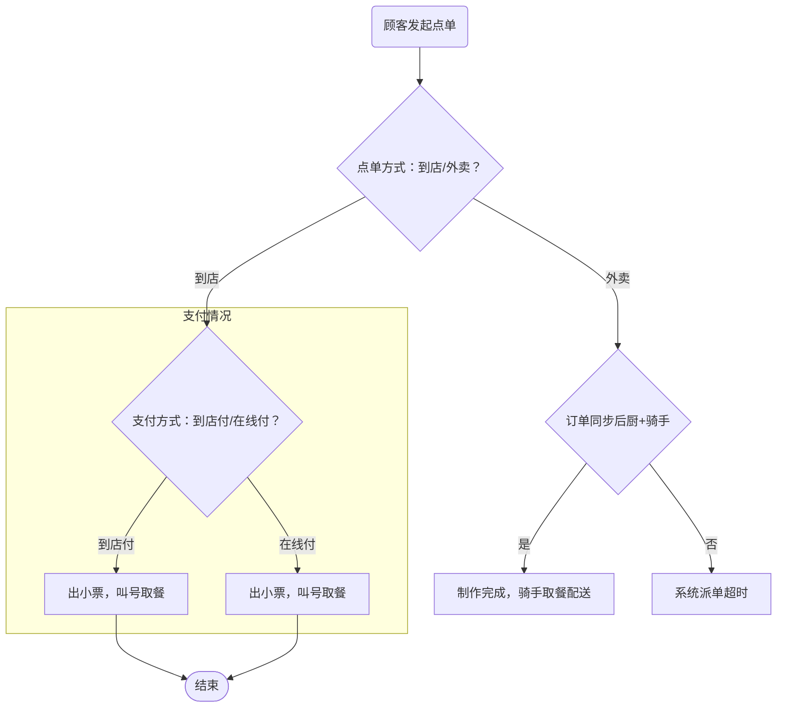

```mermaid
flowchart TD
 
 %% 奶茶点单系统

 A(顾客发起点单) -->B{点单方式：到店/外卖？}

 %% 到点制作与选择路径
 B-->|到店|C{支付方式：到店付/在线付？}
 B-->|外卖|D{订单同步后厨+骑手}
subgraph S1[支付情况]
C-->|到店付|E[出小票，叫号取餐]
C-->|在线付|G[出小票，叫号取餐]
end
E-->I([结束])
G-->I([结束])
D-->|是|F[制作完成，骑手取餐配送]
D-->|否|H[系统派单超时]


```