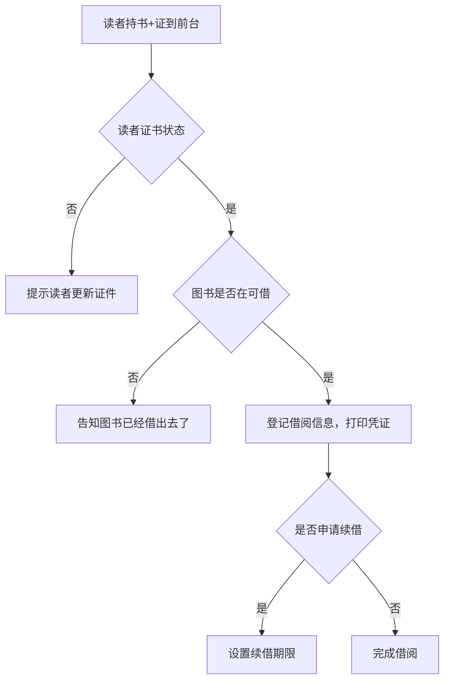

```mermaid
flowchart TD

%% 流程开始节点

A0[读者持书+证到前台] -->A{读者证书状态}

%%身份准入判定
A --> |否| B[提示读者更新证件]
A --> |是| C{图书是否在可借}

%%资产状态判定
C --> |否| D[告知图书已经借出去了]
C --> |是| E[登记借阅信息，打印凭证]

E --> F{是否申请续借}
F --> |是|G[设置续借期限]
F --> |否| H[完成借阅]


 
```